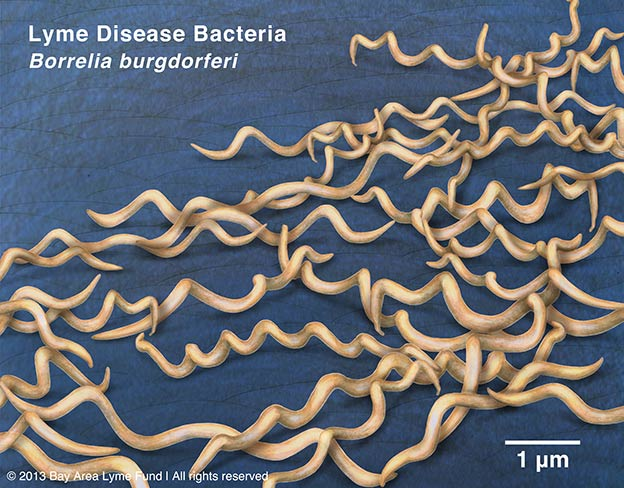

```{r setup, include=FALSE}

library(rentrez)
library(dplyr)
library(ggplot2)

```


```{r setup2, include=FALSE}
MData <- read.csv("Sequences.csv", header = T)

Data <- select(MData,Sequence, -Name)

onlyA <- gsub("[TGC]", "", Data$Sequence)
A <- nchar(onlyA)

onlyT <- gsub("[AGC]", "", Data$Sequence)
T <- nchar(onlyT)

onlyG<- gsub("[ATC]", "", Data$Sequence)
G <- nchar(onlyG)

onlyC <- gsub("[ATG]", "", Data$Sequence)
C <- nchar(onlyC)

```


strain](https://en.wikipedia.org/wiki/Borrelia_burgdorferi)



### Table showing nucleotide count for each Species

Species | A | T | G | C
----|---|---|---|---
HQ433692.1 | 154 | 114 | 131 | 82
HQ433694.1 | 155 | 114 | 131 | 81
HQ433691.1 | 154 | 115 | 131 | 81

```{r setup3 , include=FALSE}
(G+C)/(G+C+A+T)*100
```

### Calculated GC content percentage for each Speceis

Species | GC Content
----|---
HQ433692.1 | 44.28274
HQ433694.1 | 44.07484
HQ433691.1 | 44.07484


```{r setup4, include=FALSE}
GC_content <- read.csv("GC_content.csv")
GC <- mutate(GC_content, GC_p = G + C)

```

### GC content Scatter plot 
#### Scatter plot of GC content of 1000 sample species 

```{r setup5, echo = F, include= T}
qplot(data= GC, x = ID, y = GC_p,colour=Species)
```

